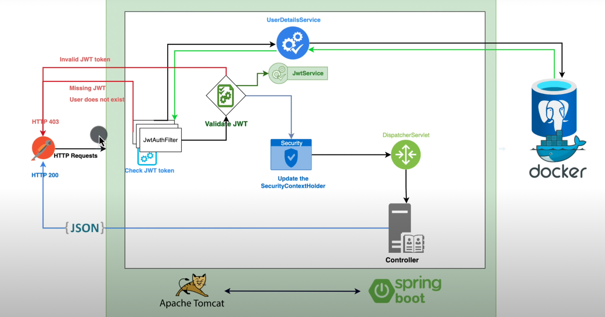

# User Api with Jwt Token

## Features
* User registration and login with JWT authentication
* Password encryption using BCrypt
* Role-based authorization with Spring Security
* Customized access denied handling
* Logout mechanism
* Refresh token

## Technologies
- Spring Boot
- Spring Security
- Spring Data JPA
- PostgreSQL
- Lombok
- JWT
- Maven

